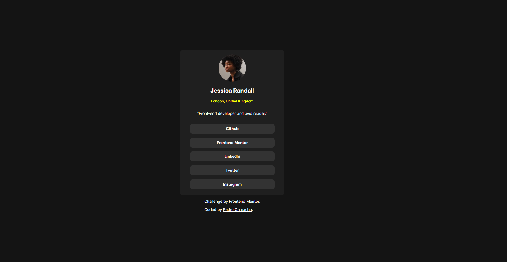

# Frontend Mentor - Social links profile solution

This is a solution to the [Social links profile challenge on Frontend Mentor](https://www.frontendmentor.io/challenges/social-links-profile-UG32l9m6dQ). 

## Overview

### The challenge

Users should be able to:

- See hover and focus states for all interactive elements on the page

### Screenshot

()

**Note: Delete this note and the paragraphs above when you add your screenshot. If you prefer not to add a screenshot, feel free to remove this entire section.**

### Links

- Solution URL: [Add solution URL here](https://your-solution-url.com)
- Live Site URL: [Add live site URL here](https://your-live-site-url.com)

## My process

### Built with

-HTML 
-CSS

**Note: These are just examples. Delete this note and replace the list above with your own choices**

### What I learned

I learned how to change the font color on an <a> text. Before, I had never done that. I usually just set it as a 
 and it is much simpler. 

## Author

- Github - [Pedro Camacho(MachoCamacho1)](https://github.com/MachoCamacho1)
- Frontend Mentor - [@MachoCamacho1](https://www.frontendmentor.io/profile/MachoCamacho1)
- LinkedIn - [Pedro Camacho] (https://www.linkedin.com/in/pcamacho93/)

**Note: Delete this note and add/remove/edit lines above based on what links you'd like to share.**
